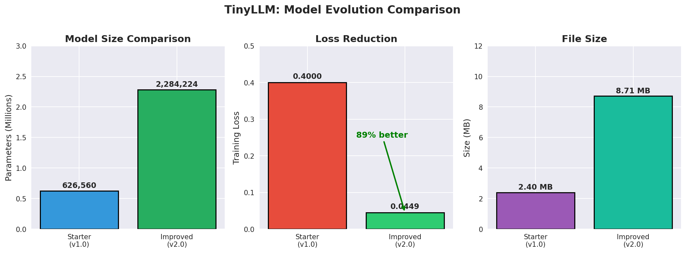

# TinyLLM

A minimal transformer-based language model with **2.28M parameters** that holds coherent English conversations. Designed for CPU-only training and inference.



## Features

- **Compact**: 2,284,224 parameters (~8.7MB model file)
- **CPU-friendly**: No GPU required for training or inference
- **Character-level**: Simple tokenization with 59 characters
- **Fast inference**: ~57 tokens/sec on CPU
- **Self-contained**: No external tokenizer dependencies
- **Low loss**: Trained to 0.0449 loss

## Architecture (v2.0)

| Component | v1.0 (Starter) | v2.0 (Current) |
|-----------|----------------|----------------|
| Parameters | 626,560 | **2,284,224** |
| Embedding Dim | 128 | **192** |
| Layers | 3 | **5** |
| Attention Heads | 4 | **6** |
| Context Window | 128 | **192** |
| Training Loss | 0.40 | **0.0449** |
| Model Size | 2.4 MB | **8.7 MB** |

## Quick Start

### Requirements

```bash
pip install torch
```

### Interactive Chat (Recommended)

```bash
python chat.py
```

### Quick Demo

```bash
python quick_chat.py
```

### Run Benchmark

```bash
python benchmark.py
```

## Files

| File | Description |
|------|-------------|
| `chat.py` | **Main** - Interactive chat interface |
| `quick_chat.py` | Non-interactive demo |
| `model.py` | TinyLLM transformer architecture |
| `train.py` | Training script |
| `benchmark.py` | Performance benchmarking |
| `tiny_llm.pt` | Pre-trained model weights |
| `dialogue.txt` | Training data |

## Example Conversation

```
You: Hello!
Bot: Hi there! How can I help you today?

You: What is AI?
Bot: AI stands for Artificial Intelligence. It refers to computer 
     systems designed to perform tasks that typically require 
     human intelligence.

You: Tell me a joke
Bot: Why did the computer go to the doctor? Because it had a virus!
```

## Performance

| Metric | Value |
|--------|-------|
| Parameters | 2,284,224 |
| Model Size | 8.71 MB |
| Avg Latency | 745 ms |
| Throughput | 57.3 tokens/sec |
| Training Loss | 0.0449 |

## Training

Train your own model:

```bash
python train.py
```

Training configuration:
- Optimizer: AdamW (lr=0.002, weight_decay=0.01)
- Epochs: 12
- Batch Size: 48
- Learning Rate Decay: 0.82 per epoch
- Gradient Clipping: 1.0

## Model Evolution

| Version | Parameters | Loss | Improvement |
|---------|------------|------|-------------|
| v1.0 | 626K | 0.40 | Baseline |
| v2.0 | 2.28M | 0.0449 | **89% lower loss** |

## Limitations

- Context window of 192 characters
- Limited vocabulary and knowledge
- Best for short, simple conversations
- Memorization-based learning

## License

MIT License

## Author

Matrix Agent

## Acknowledgments

Demonstrates that coherent dialogue is achievable with minimal parameters through careful architecture design and training optimization.
